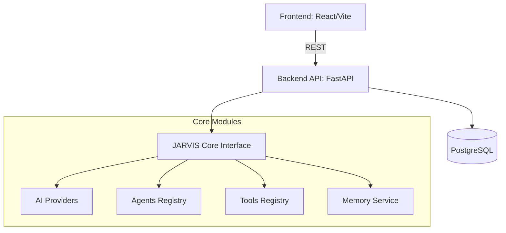

# Architecture Overview

JARVIS uses a standard 3-tier architecture with a strong emphasis on modularity for AI expansion.

```mermaid
graph TD
    UI[Frontend: React/Vite]
    API[Backend API: FastAPI]
    Core[JARVIS Core Interface]
    DB[(PostgreSQL)]
    
    UI -->|REST| API
    API --> Core
    API --> DB
    
    subgraph Core Modules
    Core --> AI[AI Providers]
    Core --> Agents[Agents Registry]
    Core --> Tools[Tools Registry]
    Core --> Mem[Memory Service]
    end
```
